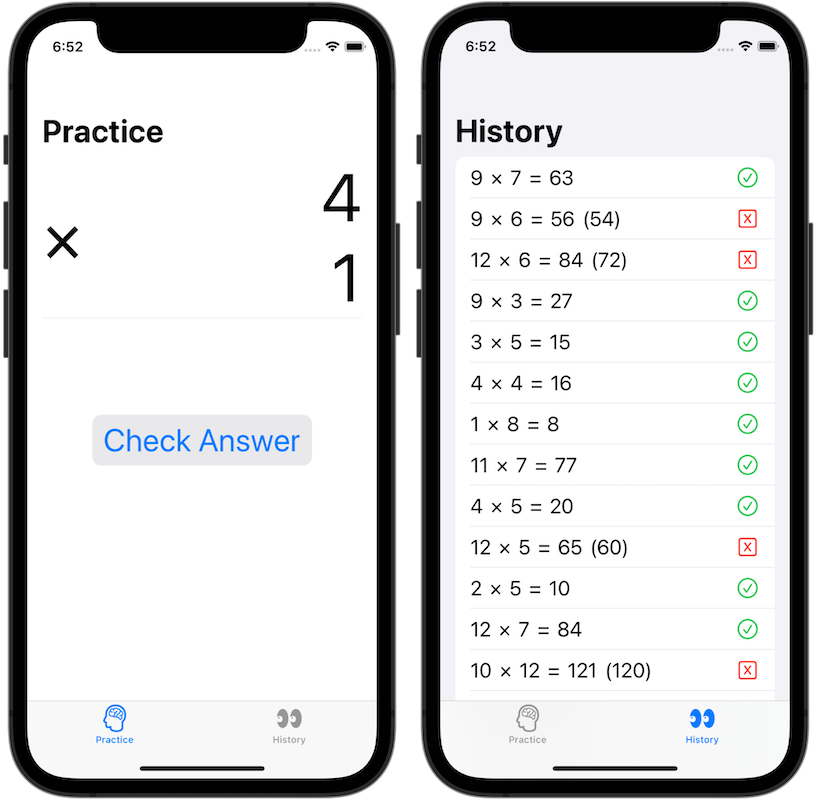
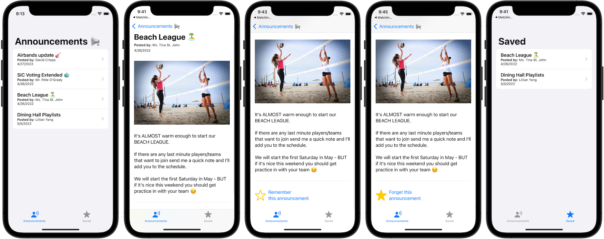

# Concept Review

This project contains example apps that take their primary input from a variety of sources.

## Input by User Action

### Multiplication Maestro

*Multiplication Maestro* generates data entirely from user actions when [answers to questions are provided in a text field](x-source-tag://mm_user_action).

Sequence and selection statements are used to detect whether the input provided by a user is the [correct response to a question](x-source-tag://mm_answer_correct).

Abstraction is used in the views that together form the [primary quizzing interface](x-source-tag://mm_primary_interface) of the app:

* [`QuestionPresentationView`](x-source-tag://mm_question_presentation)
* [`AnswerAndResultView`](x-source-tag://mm_answer_and_result)
* [`CheckAnswerButtonView`](x-source-tag://mm_check_answer_button)
* [`NewQuestionButtonView`](x-source-tag://mm_new_question)

This helps to manage complexity as without these "helper" views the code for the entire quizzing interface would be quite long. By "abstracting out" the logic for individual parts of the larger interface into their own smaller views, we can test discrete parts of the app separately from the larger whole. This makes it easier to test new code and track down bugs.   

As questions are answered, results are added to the list, with the most recent question at the top. The contents of the list are then available for review by the user. The *results* list manages complexity by allowing us to display an open-ended number of prior questions that the user has completed. We don't know how many questions a user will complete. It's not possible to predict how many individual variables would be needed. Instead, as each question is completed, we can simply create a new instance of the [`Result` structure](x-source-tag://mm_result_structure) and then [add that to the list](x-source-tag://mm_adding_to_list).

* Callout(Bug Hunt):
  A friend noticed that when a user has answered a question without providing a response (perhaps because they don't know the answer) that this looks a little odd in the history of prior questions. 🔎 
  
  Your friend suggested that it looks like something isn't working in the app in this case.
  
  How might you indicate, in the history of prior questions, that a blank response was provided by the user?
  
  Make the necessary code changes to correct for this.

* Callout(User Experience Refinement):
  You received a review for *Multiplication Maestro* on the App Store that mentioned the interface feels crowded on devices with smaller screen sizes. 🧐 
  
  To make your app work better on all devices, you decide to move the list of prior results to a separate tab.
  
  See if you can modify the code in *Multiplication Maestro* so that the interface looks the same as shown below. You'll need to move the *source of truth* for the list of prior results to the app level file, [`MultiplicationMaestroApp.swift`](x-source-tag://mm_app_level). Then pass that list to `ContentView.swift` which holds the primary quizzing interface, and to a new view that you will create to hold the history. 
  
  What *property wrapper* will you need to use on the two views that receive the list from the app level file, so that any changes to the list on those tabs are sent up to the source of truth?

### Noughts and Crosses

*Noughts and Crosses*, also known as "x's and o's", generates data entirely from [user actions that trigger events](x-source-tag://user_action).

Sequence and selection statements are used to detect a [winning condition](x-source-tag://winning_condition) – three of the same symbol in a row, column, or diagonal. If nine turns occur and neither player's moves triggers a winning condition, a draw is obtained.

Abstraction is used through the [`TileView` structure](x-source-tag://tile_view) – this helps to manage complexity as the same logic would otherwise be completely repeated nine times within `GameBoardView`. Instead, the logic for a tile is *defined* once and simply *called* nine times from [`GameBoardView`](x-source-tag://game_board). As a result, overall project code length is significantly reduced.

When a game is completed, the [result is added to a list](x-source-tag://adding_to_list) that tracks the history of games played. This list is then displayed to the user in the History section of the user interface. The list helps to manage complexity because we do not know how many games a user will play in advance; it is not possible to predict how many individual variables we'd need to create. So instead we create a new instance of the [`GameResult` structure](x-source-tag://nac_game_result) every time a game is completed, and add that to the list, whose maximum capacity for holding past games is open-ended, limited only by available memory on the device.

* Callout(Bug Hunt):
  Develop your logical error detective skills. 🔎 
  
  There are at least three problems with the logic of this app.
  
  Play some games, tap around, and try to do things that a user should not do. Break the game!
  
  Once you find the problems, fix them.
  
  Then [on Spaces](https://ca.spacesedu.com/), identify the problems you found, and share your solutions, in your private portfolio space.
 
−

* Callout(Animation Action):
  Small animations add a lot of flair to an app. ✨ 
  
  When a tile is tapped and filled in with a player's symbol, make the tile rotate twice, quickly.

## Input from an Online Data Stream

### Song Browser

*Song Browser* draws all it's data from the endpoint provided by the [iTunes Search API](https://affiliate.itunes.apple.com/resources/documentation/itunes-store-web-service-search-api/).

A JSON-formatted response provides a list of songs that match the search term.

Selection is used to determine whether a song is a favourite or not.

Abstraction is used to build the song detail view; each part of that user interface is provided by a smaller "helper" view.

A list is used to display results.

* Callout(Culminating Task Possibilities):
  Song Browser is an interesting app because an endpoint provides it with interesting data. 🎶 
  
  Possibilities for apps that draw data from an online stream structured in the JSON format are broad.
  
  Browse some of the resources below. What apps can you imagine, built upon the data these endpoints provide? 

  * [Advice Slips](https://api.adviceslip.com)
    * Provides small nuggets of wisdom on demand.
    * There is no authentication required to use this endpoint.
  * [AirVisual API](https://api-docs.iqair.com/?version=latest)
    * Provides air quality data for locations all over the world.
    * An API key is required to access this endpoint; this can be obtained free of charge.
  * [Calendarific](https://calendarific.com/api-documentation)
    * "Calendarific is a developer-friendly ... API giving you access to public, local & bank holidays and observances; and spanning over 230 countries, 3,300+ states and 100+ languages."
    * An API key is required to access this endpoint; this can be obtained free of charge.
  * [Deck of Cards API](https://deckofcardsapi.com)
    * Everything you need to implement a game that involves the use of a deck of cards.
    * There is no authentication required to use this endpoint.
  * [Dungeons and Dragons API](http://www.dnd5eapi.co)
    * Query the 5th edition of the Dungeons and Dragons System Reference Document for details on spells, monsters, et cetera.
    * There is no authentication required to use this endpoint.
  * [Exchange Rates](https://exchangeratesapi.io)
    * A free service providing current and historical foreign exchange rates.
    * An API key is required to access this endpoint; this can be obtained free of charge.
  * [Image Charts](https://documentation.image-charts.com)
    * Send a request to this endpoint and it will return a chart or graph in your desired image format.
    * There is no authentication required to use this endpoint.
  * [Joke API](https://github.com/15Dkatz/official_joke_api)
    * A web service that serves jokes in various formats.
    * There is no authentication required to use this endpoint.
  * [jService](http://jservice.io/)
    * A set of trivia questions based on prior Jeopardy! clues.
    * There is no authentication required to use this endpoint.
  * [Meal Database](https://www.themealdb.com/api.php)
    * A web service that provides information about food and meals, based on categories and other criteria.
    * There is no authentication required to use this endpoint.
  * [Numbers API](http://numbersapi.com/?ref=apilist.fun#42)
    * "Bring your metrics and dates to life."
    * Provides trivia and interesting information about numbers and dates.
    * There is no authentication required to use this endpoint.
  * [Open Movie Database](http://www.omdbapi.com)
    * The OMDb API is a web service to obtain movie information. 
    * There is no authentication required to use this endpoint.
  * [Open Trivia Database](https://opentdb.com/api_config.php)
    * Another source of trivia questions and answers. Can be queried by category. 
    * There is no authentication required to use this endpoint.
  * [Song Lyrics API](https://lyricsovh.docs.apiary.io/#reference/0/lyrics-of-a-song/search?console=1)
    * A service that provides lyrics for songs.
    * There is no authentication required to use this endpoint.
  * [Spoonacular](https://spoonacular.com/food-api/docs)
    * Provides nutrition, recipe, ingredients, and allergens data for food.
    * An API key is required to access this endpoint; this can be obtained free of charge.
  * [Stock News API](https://stocknewsapi.com/)
    * "Get the latest stock news from the best news sources. Use our API and access clean and relevant stock market news data."
    * An API key is required to access this endpoint; this can be obtained free of charge.
  * [Star Wars API](https://swapi.dev/documentation)
    * "All the Star Wars data you ever wanted."
    * There is no authentication required to use this endpoint.
  * [Weather API](https://www.metaweather.com/api/)
    * Given a latitude, longitude, city, or other search criteria, obtain a current weather forecast.
    * There is no authentication required to use this endpoint.

### Announcements

*Announcements* takes all of it's input data from a remote endpoint – the difference is that this endpoint draws it's data from [a spreadsheet](https://docs.google.com/spreadsheets/d/1yy7ZEUfnW5L2jr_IFKh0Nj1NUrTU7PlsCeFU3z-2_Hc/edit#gid=0) that you, as the programmer, control!

This is made possible by the [Sheety service](https://sheety.co), which converts Google Sheets data into JSON formatted data.

As a result, the input to your app is now *flexible* and easily updated.

You can distribute the app, and as data changes in the spreadsheet, what is displayed to users within your app will update to reflect those changes. 

An example of where sequence matters in this app is when [an announcement that is being saved by the user is reported up to the spreadsheet](x-source-tag://a_sequence). First the announcement being saved must be encoded in JSON format. Only *after* that occurs can the data be sent to the spreadsheet via the remote endpoint.

One example of a selection statement being used is to [determine whether an announcement is currently saved or not](x-source-tag://a_selection_statement).

An example of when abstraction is used is the "star" button at the bottom of the announcement detail page. This button, an instance of `SaveAnnouncementButtonView`, is used to save (or remove) an announcement from the list of saved announcements. There is a significant amount of logic within that view. If that logic was kept directly inside the `AnnouncementDetailView` structure, that structure's code would become very long and hard to read. This is an example of how applying abstraction helps to manage complexity. The code in `AnnouncementDetailView` is easier to read and debug because we have abstracted out a lot of functionality into `SaveAnnouncementButtonView`.

Lists play a large role in how *Announcements* works.

A [list is used to receive data](x-source-tag://a_announcements_list) from the remote spreadsheet. This is the primary list the user sees when browsing announcements. Since we do not know how many announcements will be received into our app at any given time, a list must be used. It would not be possible to write this app by trying to use individual variables to present each announcement.

Another example of lists being used is to [track saved announcements that the user wants to remember](x-source-tag://a_saved_announcements). This list is initialized at the app level using the `@State` property wrapper, because that is the source of truth for the list – where it is first created. The list is then shared as a reference to the other views that need to use it. In those views, the list is a derived value, so we mark it with the `@Binding` property wrapper. 

## Input from File in App Bundle 

### Matching Game

*Matching Game* could not exist without input from files in the app bundle. A [JSON file provides items that are to be matched](x-source-tag://mg_input_from_file), and images are stored in the **Assets** folder.

Input to this app also occurs through user actions – for example, when the user taps on an image.

Sequence and selection statements are used to determine whether the user [selected the correct response](x-source-tag://mg_answer_correct).

* Callout(Bug Hunt):
  Develop your logical error detective skills. 🔎 
  
  There is at least one problem with the logic of this app.
  
  Play some games, tap around, and see what you notice.
  
  Once you find the problem, fix it!
  
  Then [on Spaces](https://ca.spacesedu.com/), identify the problem you found, and share your solution, in your private portfolio space.
  
−

* Callout(Abstraction):
  Manage complexity by reducing code duplication. 🛠 
  
  Review the `GameView` and `MatchPresentationView` structures in *Matching Game*.
  
  Do you see any repetitive code?
  
  If so, apply *abstraction*, and create a helper view that can be re-used.
  
  When you create your helper view, consider whether the values of any properties need to be sent back to a source of truth on the calling view.
  
  If so, mark those properties with `@Binding`. 

−

* Callout(Incomplete Features):
  The user would probably like to know how successful they've been at matching words to images. 🤔 
  
  Review properties that exist on the `GameView` structure.
  
  How can you connect those properties to the `MatchPresentationView` structure, so that you can give the user feedback about how they are doing?
  
  Then create space in the user interface to display that data in some way.
